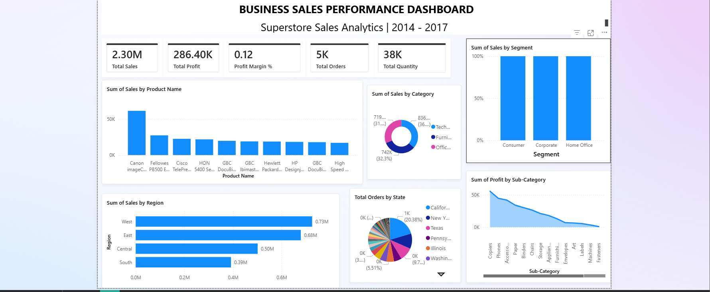

# FUTURE_DS_01
Interactive Power BI dashboard analyzing Superstore sales performance (2014–2017) with KPIs, regional insights, category analysis, profit trends, and business intelligence visualizations.

# 📊 Business Sales Performance Dashboard

An interactive Power BI dashboard built using the Superstore dataset to analyze sales performance, profitability, customer segments, and regional trends.

## 🚀 Project Overview

This dashboard provides a comprehensive analysis of retail business performance from 2014 to 2017. It helps identify key sales trends, profitable product categories, top-performing regions, and customer segment contributions through interactive visualizations.

## 📂 Dataset

- Dataset: Superstore Sales Dataset
- Source: https://www.kaggle.com/datasets/vivek468/superstore-dataset-final

## 📈 Dashboard Features

### Key Performance Indicators (KPIs)
- Total Sales
- Total Profit
- Profit Margin
- Total Orders
- Total Quantity Sold

### Visualizations
- Sales by Product
- Sales by Category
- Sales by Region
- Sales by Segment
- Orders by State
- Profit by Sub-Category

### Interactive Elements
- Slicers and Filters
- Drill-Down Analysis
- Dynamic Reporting

## 🛠 Tools Used

- Power BI Desktop
- Power Query
- DAX (Data Analysis Expressions)
- Data Modeling

## 🔍 Key Insights

- Total Sales exceeded $2.3M.
- Total Profit reached approximately $286K.
- The West region generated the highest sales.
- Technology was one of the top-performing categories.
- Consumer customers contributed significantly to overall revenue.

## 📸 Dashboard Preview



## 📁 Repository Structure

```text
Business-Sales-Performance-Dashboard/
│
├── Dashboard.pbix
├── Superstore.csv
├── dashboard.png
└── README.md
```

## 🎯 Learning Outcomes

- Data Cleaning and Transformation
- Business Intelligence Reporting
- Dashboard Design
- KPI Development
- Data Storytelling
- Business Performance Analysis

## 👩‍💻 Author

**Aswathy Santhosh**

B.Tech CSE (Artificial Intelligence)

LinkedIn: www.linkedin.com/in/aswathy-santhosh-9932a5328

---

If you found this project useful, feel free to ⭐ the repository.
